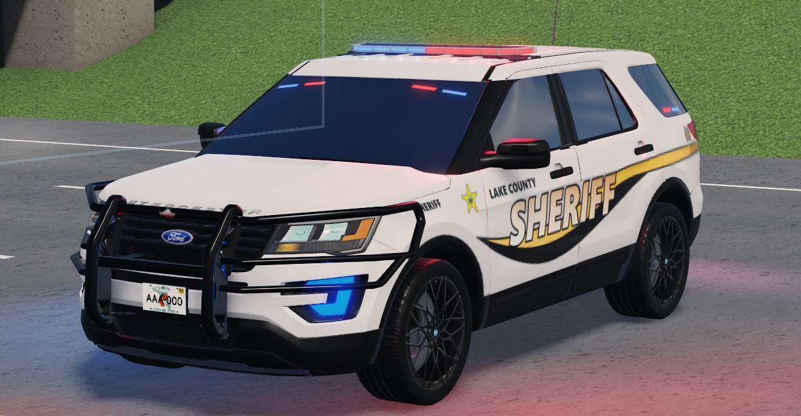
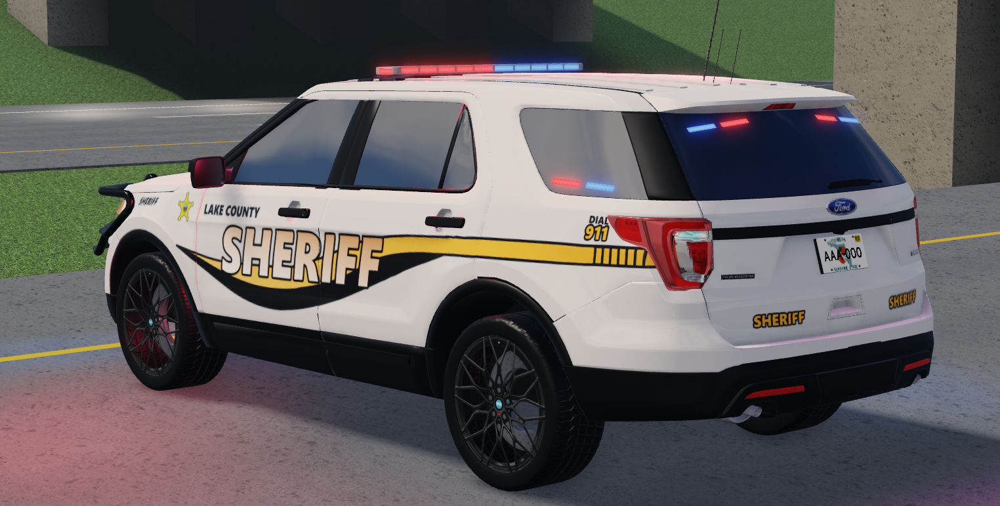
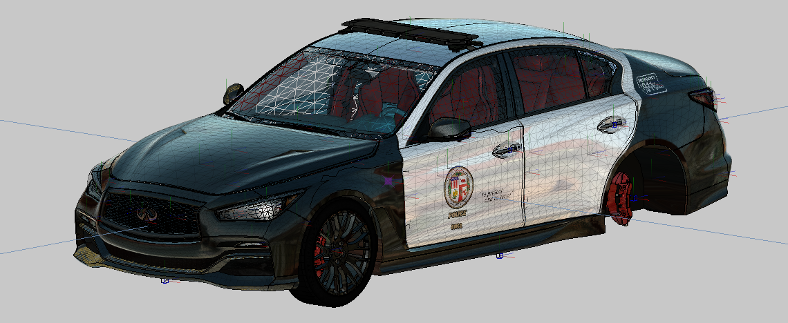
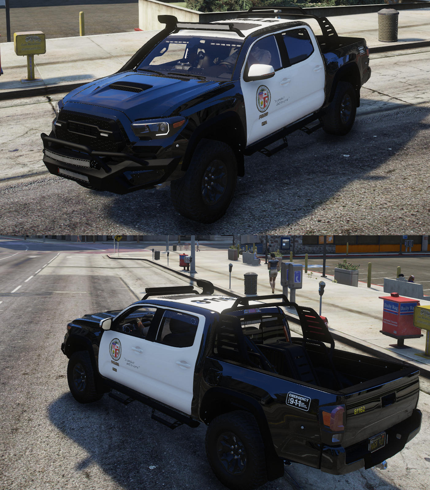

# DoraAsync

**Roblox Full-Stack Developer**  
Lua • Luau • UI Design • VFX Design  
Contributed to experiences with **20M+ total visits** (End of 2025 data)

---

## About Me

Hi, I am a 16 year old Roblox full-stack developer living in hungary, focused on building scalable gameplay systems, clean architecture, and polished player experiences.
My experience spans across **client and server scripting, UI systems/design, visual effects, and backend logic**. I tend to focus development on modular systems designed for performance and easy expansion.
A large portion of past work involved **vehicle-based experiences and A-Chassis systems**, though development is not limited to vehicle frameworks. I started public game development at the end of september 2024.

---

## Skills

### Programming
- Lua
- Luau
- Client / Server architecture
- Modular system design
- RemoteEvents & RemoteFunctions
- Performance optimization
- Debugging and system architecture

### Game Systems
- DataStore systems
- Player progression systems
- Server management
- Scalable game frameworks

### UI Development
- UI design
- UI animation
- Responsive UI systems
- TweenService based effects

### Visual Effects
- Gameplay VFX scripting
- UI effects and transitions
- Feedback effects for gameplay systems
- Vehicle Lighting/ELS Systems

### UV-Mapped Texture/Livery Designs
I can design textures and liveries for mesh parts within the game.

Examples:
- vehicle race livery
- police car livery
- recreate 1-1 real liveries

---

## Experience

### Gameplay Systems
Development of reusable gameplay systems across multiple Roblox experiences.

Examples:
- player stat frameworks
- modular game systems
- server logic

### UI and Player Experience
Design and scripting of responsive UI systems focused on usability and clarity.

Examples:
- menus and HUD systems
- animated UI elements
- data-driven interfaces

### Technical Background
Extensive work on **vehicle-focused games**, including deep familiarity with **A-Chassis systems and vehicle mechanics**.

---

## Contributions

Projects contributed to have **20M+ combined visits**.

Areas of contribution include:

- gameplay systems
- backend scripting
- UI systems
- visual effects
- system architecture

---

## Tools

- Roblox Studio
- Blender
- Visual Studio Code
- Flaticon.com
- Adobe Photoshop
- Zmodeler3

---

## Contact

- **Roblox:** DoraAsync  
- **Discord:** not.async
- **Email:** DoraAsync@gmail.com

## Images

Roblox Vehicle lights and livery (2 yr old livery of mine)

GTA 5 Vehicle lights and livery + UV mapped by me (just made this not long ago for a server)

GTA 5 livery + UV mapped by me (just made this not long ago for a server)

